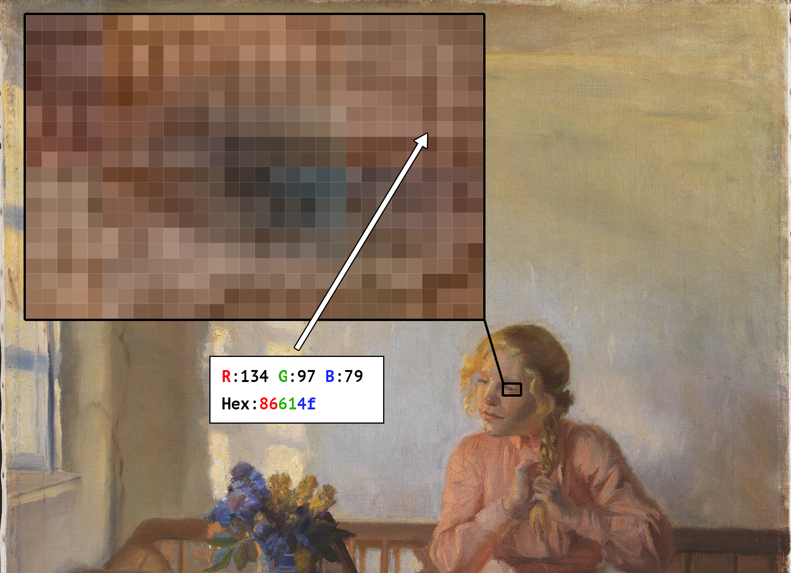
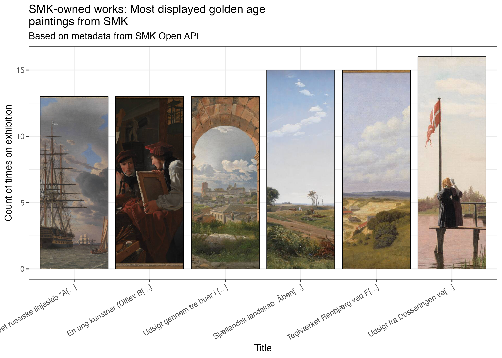
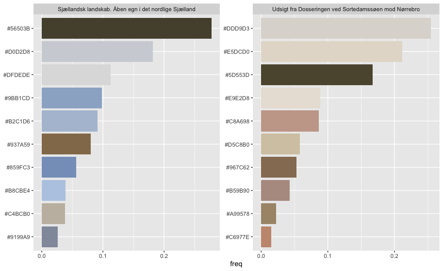

# Afkod Kunsten / Decode Art

About the workshop: 
Art and culture is increasingly digital - so must our methods and analytical apporaches be! 

* How does a computer view a painting versus a human? 
* What is a pixel and an API?
* What are the most popular colors used in paintings in the collections of the Danish National Gallery from 1800s?
* Which artworks have been exhibited the most and where? 
  
These are some of the questions we discuss throughout or workshop. Throughout the course you will be introduced to digital collections as a cultural phenomenon, as well as practical ressources and methods for how you can use data- and metadata analysis in your work with art and collections.   

## Links to resources for in-class and future reference
* [Powerpoint for workshop - Danish](https://github.com/maxodsbjerg/AfkodKunsten/blob/main/powerpoints/Afkod%20Kunsten%20PP.pdf)
* [Powerpoint for workshop - English](https://github.com/maxodsbjerg/AfkodKunsten/blob/main/powerpoints/Decode%20Art%20PP.pdf)
* [Link to workshop survey](https://www.survey-xact.dk/LinkCollector?key=UADDX2NWLPCN)
* [Dall.E2](https://openai.com/dall-e-2/) 
* [Link to podcast - How museums can deepen engagement with audiences?](https://www.theheritagelab.in/museum-digital-audience-engagement/)
* [Link to article - Using Computers to Better Understand Art](https://theconversation.com/using-computers-to-better-understand-art-56887)
* [Link to article - Revealing hidden collections through digital engagment](https://www.culturehive.co.uk/resources/revealing-hidden-collections-through-digital-engagement/)

### R learning material:
* [R for Data Science](https://r4ds.had.co.nz)
* [Text Mining with R](https://www.tidytextmining.com)
